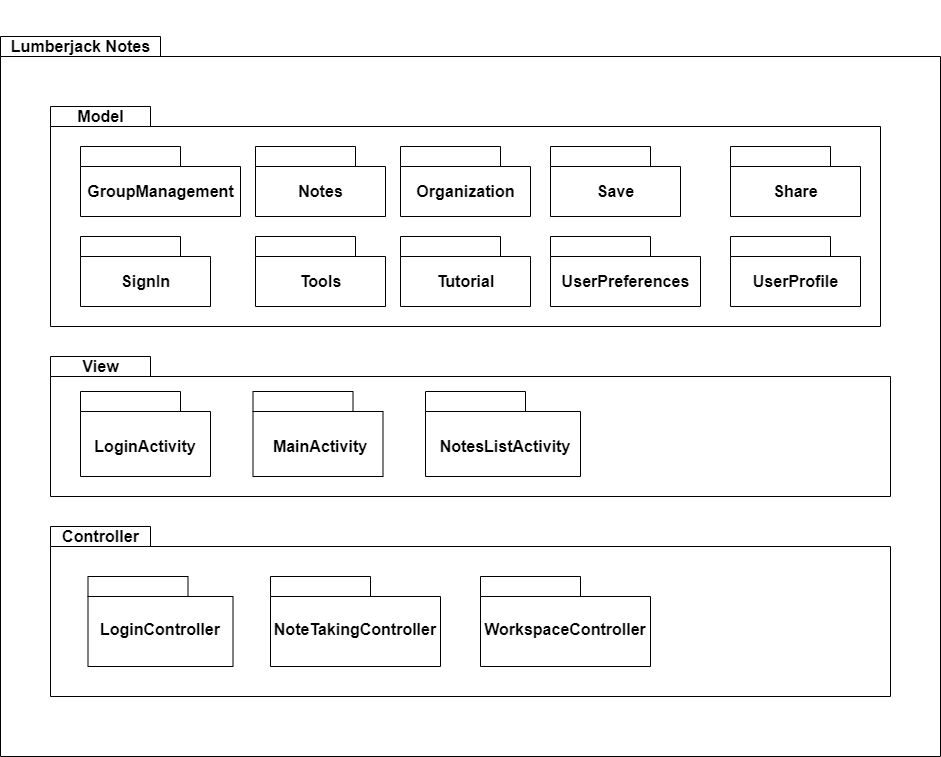
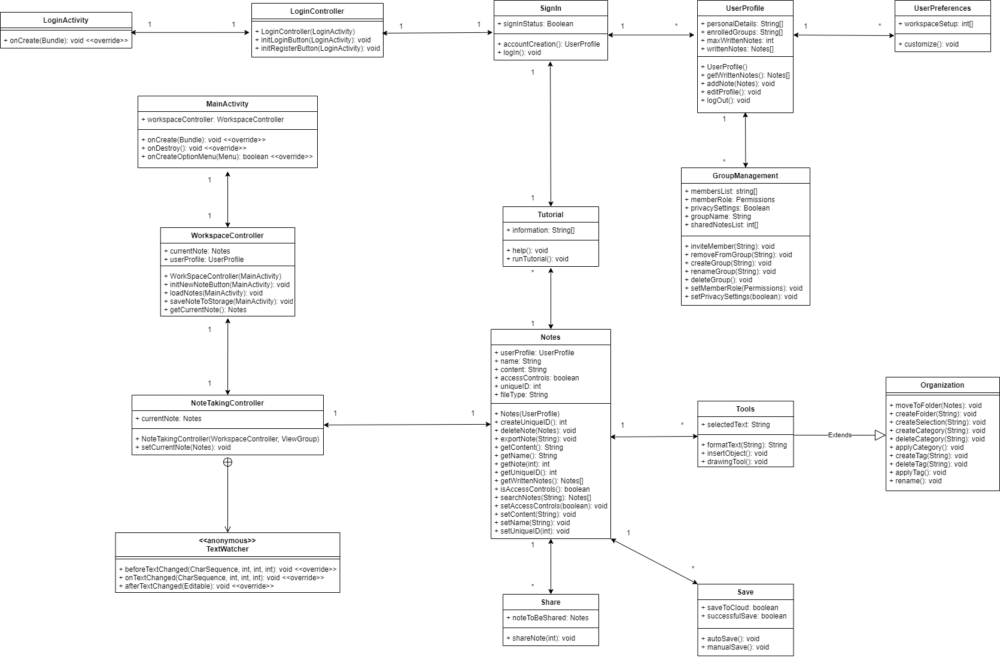

# Design
Group 04 - "[Lumberjack Notes]"  
Date and location: March 28, 2021  
Group Members: Gustavo Valencia, Armando Martinez, Stefan Mihailovic, Nicholas Botticelli, Collin Rampata, Kyle Austria

## 1. Description

Lumberjack Notes is a free note-taking application designed to help students and professionals collaborate and share
their notes with their colleagues. Our application aims to provide a user-friendly interface with an intuitive
note-taking environment. Users of Lumberjack Notes will have the ability to customize and modify their workspace to
fit their needs. Users will also have the option to share their notes with fellow students or colleagues.

While Lumberjack Notes is still in early development, the app aims to provide a customizable and user-friendly
interface, as well as an unobtrusive note-taking environment. The user can edit and rearrange the tools in the toolbar
to their liking. These tools can also be utilized while typing so that users note-taking experience is more fluid. The
user will also have easy access to a search function that will allow them to quickly view other notes they have
written. They will also be able to quickly access or modify their profile.

GitHub: https://github.com/CS386-Group-4/LumberjackNotes

Trello: https://trello.com/b/3lbd1jw9/cs-386-notes-app

## 2. Architecture

The architecture we implemented for Lumberjack Notes is MVC (Model–View–Controller). The model layer describes the data
structure to hold information, the view layer contains the representation of the user interface presented to the user,
and the controller layer accepts user input and controls model data. We used this architecture for our app for its
simplicity and effectiveness in structuring the code in an organized and extensible manner.

## 3. Class diagram

## 4. Sequence diagram

**Use Case**: Take Notes  
**Actor**: User  
**Description**: The user creates a page where they are able to take notes  
**Preconditions**: The user has created an account on the platform  
**Post-conditions**: The user should have a workspace where they can take and edit notes  
**Main Flow**:
1. The user selects a workspace
2. The user can write or draw notes
3. The user should be able to save their notes and come back to them at a later date

**Alternate Flow**:
- None

## 5. Design Patterns

## 6. Design Principles
