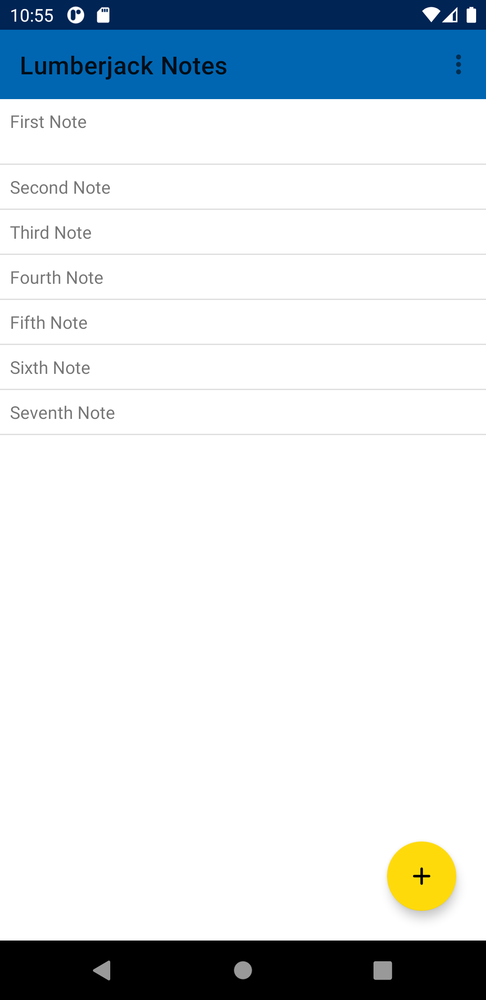
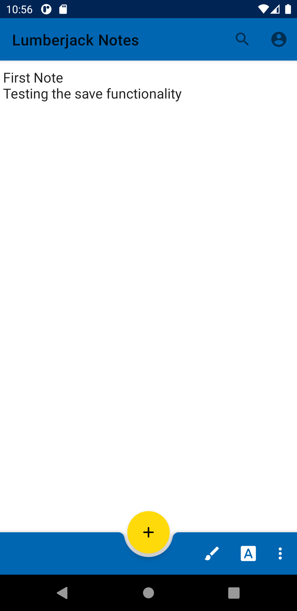
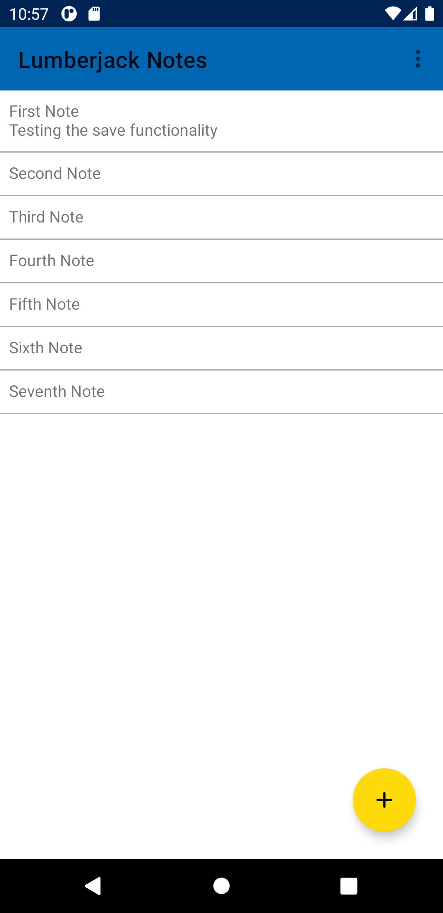
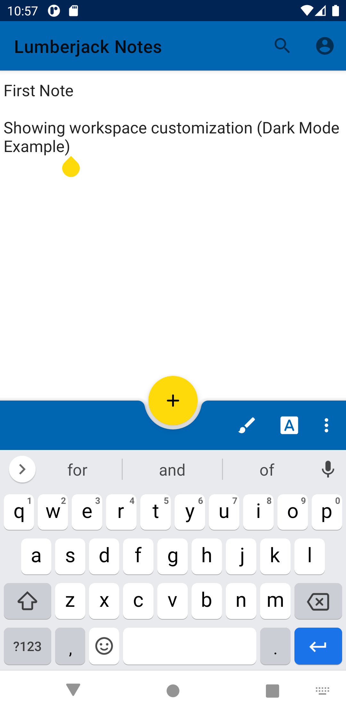
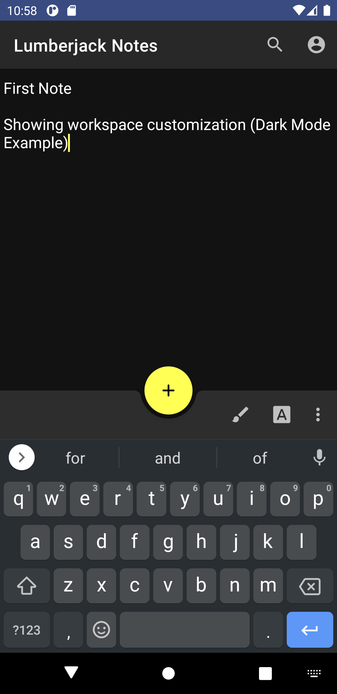

# Implementation 2
Group 04 - "[Lumberjack Notes]"  
Date and location: April 11, 2021  
Group Members: Gustavo Valencia, Armando Martinez, Stefan Mihailovic, Nicholas Botticelli, Collin Rampata, Kyle Austria

## 1. Introduction

Lumberjack Notes is a free note-taking application designed to help students and professionals collaborate and share
their notes with their colleagues. Our application aims to provide a user-friendly interface with an intuitive
note-taking environment. Users will have a streamlined experience to save and access notes. Users will also be able to
utilize note taking tools with the text editor at the same time making workflow more fluid.

GitHub: https://github.com/CS386-Group-4/LumberjackNotes

Trello: https://trello.com/b/3lbd1jw9/cs-386-notes-app

## 2. Implemented requirements

1. User Story: “As a college student, I want to have a streamlined experience to easily access and save notes.”  
    - Priority: 1  
    - Estimated Hours: 12

[Link to Trello Card](https://trello.com/c/PP8MOc3s)

[Link to Pull Request](https://github.com/CS386-Group-4/LumberjackNotes/pull/163)

Name of Implementer(s): [Gustavo Valencia](https://github.com/GustavoMiguelValencia) and [Nick Botticelli](https://github.com/nick-botticelli)

Name of Reviewer/Approver: [Nick Botticelli](https://github.com/nick-botticelli)

Screenshot(s) Depicting Implemented Feature:

2. User Story: "As a college student, I want to be able customize my note-taking workspace to fit my specific needs to
enhance my experience."  
    - Priority: 3  
    - Estimated Hours: 12

[Link to Trello Card](https://trello.com/c/mXxqQ24y)

[Link to Pull Request](https://github.com/CS386-Group-4/LumberjackNotes/pull/153)

Name of Implementer(s): [Collin Rampata](https://github.com/Crampata) and [Nick Botticelli](https://github.com/nick-botticelli)

Name of Reviewer/Approver: [Nick Botticelli](https://github.com/nick-botticelli)

Screenshot(s) Depicting Implemented Feature:

## 3. Demo

Demo Link: https://www.youtube.com/watch?v=RRkJhQmXec8

## 4. Code quality

For the project architecture, we implemented several design patterns to keep the codebase organized, clean, and
understandable. Examples of these techniques include:

- **Singleton Design Pattern:** We implemented this design pattern in the UserProfile feature of Lumberjack Notes.
- **Bridge Design Pattern:** This design pattern was implemented into the Tools feature of our application. The fact
that this class extends the Organization class is indicative of the pattern.

We also selected a design pattern at the start of our implementation and have been abiding by it throughout the
creation of Lumberjack Notes to ensure that our code can be easily managed:

- **MVC Architecture:** At the beginning of our first release, we decided to adhere to this software architecture so
that our code was set up in a familiar and understandable way. We have been abiding by the MVC architecture ever since
and it has proved to be an effective way of separating the concerns and responsibilities of parts of our code.

The team also followed certain best practices to ensure that code quality was always our highest priority:

- **Pair Programming:** The team found it extremely beneficial during this release to code with a partner. This led to
a higher quality of code overall because multiple people were working on one feature at once. This also led to higher
efficiency since everyone knew what was happening in the code.
- **Documentation:** Every feature that is included in Lumberjack Notes is well documented with JavaDocs documentation
to ensure that our code can be easily understood by other developers.
- **Software Principles:** Over the course of this release, we kept the SOLID and DRY design principles in mind so that
we were producing manageable software.

## 5. Lessons learned

Over the course of the second release, our team gained knowledge in several different areas of software development.
For many members of the team, it was their first time using AWS Amplify (or any AWS Service for that matter). This
service provided us with valuable experience in back-end development and was imperative for the creation of our log-in
and sign-up features. We found the construction of this especially challenging however, and if we could start over and
select a different back-end service, our team would have used Google FireBase instead of AWS. There were several errors
that we encountered in AWS Amplify that were not included in the documentation, so solving them deemed to be very
challenging since we had nothing to reference. Despite these obstacles, our team was able to work collaboratively to
overcome them. We managed our time much better during our second release and that helped mitigate a crunch before the
deadline.
