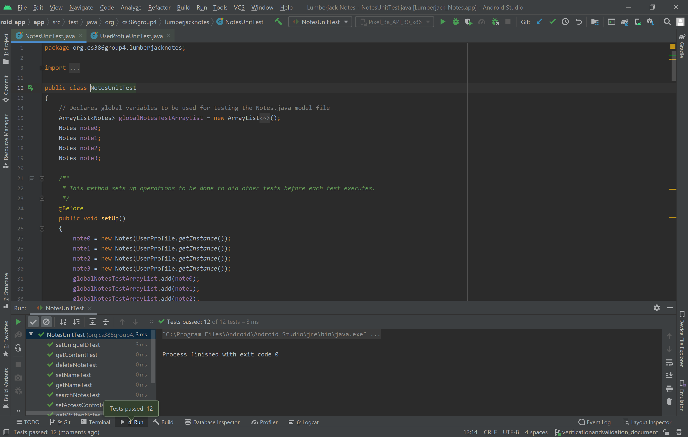
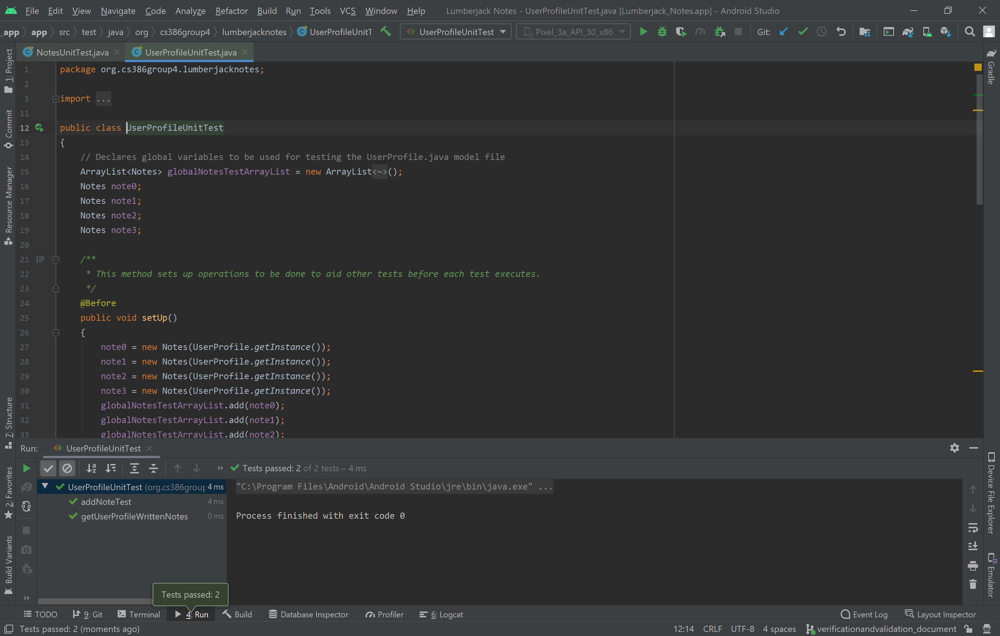
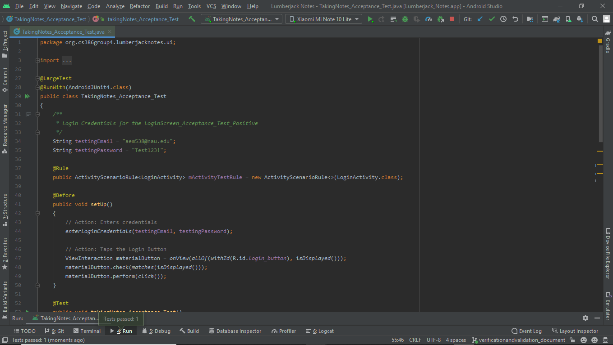
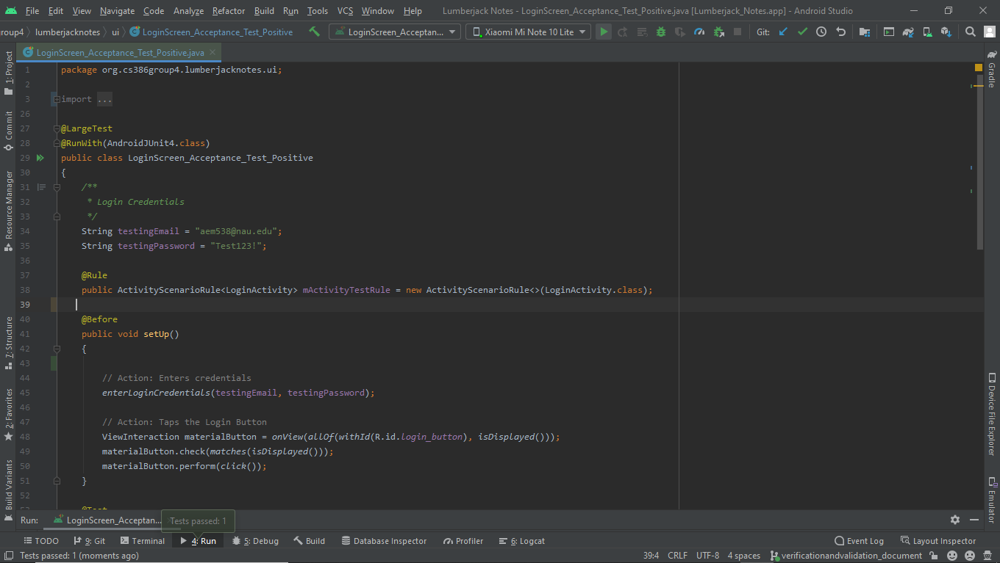

# Verification & Validation
Group 04 - "[Lumberjack Notes]"  
Date and location: April 18, 2021  
Group Members: Gustavo Valencia, Armando Martinez, Stefan Mihailovic, Nicholas Botticelli, Collin Rampata, Kyle Austria

## 1. Description

TODO: Insert 1-2 paragraphs describing system.

GitHub: https://github.com/CS386-Group-4/LumberjackNotes

Trello: https://trello.com/b/3lbd1jw9/cs-386-notes-app

## 2. Verification (tests)

### 2.1 Unit test

#### 2.1.1

We chose to use JUnit as our testing framework for our unit tests because it is by far the most popular and widely-used
unit testing framework for Java. Android Studio includes JUnit4 for testing by default and also provides an example
unit test file for reference.

#### 2.1.2

The automated unit tests can be found in our test folder
[here](../android_app/app/src/test/java/org/cs386group4/lumberjacknotes).

#### 2.1.3

An example of a test case that uses mock objects is our
[setAccessControlsTest()](../android_app/app/src/test/java/org/cs386group4/lumberjacknotes/NotesUnitTest.java#L163).
The setAccessControlsTest() method utilizes a mock ArrayList of Notes objects named globalNotesTestArrayList. The
globalNotesTestArrayList is populated with mock Notes objects to be used for testing. Whenever the test suite runs the
setAccessControlsTest() test, the access controls of mock Notes objects within the mock ArrayList object
globalNotesTestArrayList are modified and tested.

Link to class being tested can be found
[here](../android_app/app/src/main//java/org/cs386group4/lumberjacknotes/models/Notes.java).

Link to the test on class above can be found
[here](../android_app/app/src/test/java/org/cs386group4/lumberjacknotes/NotesUnitTest.java).

#### 2.1.4

Screenshot of the Notes.java unit tests executing:

Screenshot of the UserProfile.java unit tests executing:

### 2.2 Integration tests

#### 2.2.1

TODO: Insert information about test framework used to develop our tests

#### 2.2.2

TODO: Insert link to GitHub folder where automated integration tests are located

#### 2.2.3

TODO: Insert example of integration test
TODO: Insert GitHub link to test and explanation about the parts of the system
being exercised by the test

#### 2.2.4

TODO: Insert screenshot showing integration test executing

### 2.3 Acceptance

#### 2.3.1

We chose to use Espresso for our acceptance tests, with JUnit as our runner. Some of the code generated by Espresso had to be modified for more efficient testing.

#### 2.3.2

The automated unit tests can be found in our test folder
[here](../android_app/app/src/test/java/org/cs386group4/lumberjacknotes/ui).

#### 2.3.3

An example of an acceptance test is [TakingNotes_Acceptance_Test](../android_app/app/src/test/java/org/cs386group4/lumberjacknotes/ui/TakingNotes_Acceptance_Test.java#L163).
The TakingNotes_Acceptance starts by loggin in into a valid testing account. After that, the test accesses the first note and replaces te text in the first note with a testing string. Finally, the test goes back and tests if the change was made successfully. 

#### 2.3.4

Screenshot of the TakingNotes_Acceptance_Test.java executing:

Screenshot of the Login_Screen-Acceptance_Test_Positive.java executing:

## Validation (user evaluation)

### Script

- On a scale of 1-10, how would you rate the look of our sign in/sign up pages?
- Was the sign up process straightforward, or can it be improved?
- How would you rate the look of the notes list page, using the same scale?
- Can you go ahead and sign out of the app? Was it difficult to figure out how to sign out?
- Was the sign in process straightforward, or can it be improved?
- Can you go ahead and click on a note? Does the note-taking environment look clean/minimalistic, or do you think it is
 too “busy”?
- How would you rate the look of the tool bar, using the same scale?
- How do you feel about the toolbar coming up with the keyboard when writing a note?
- Do you think the toolbar coming up is convenient or should it be placed somewhere else?
- Is there anything you feel we can improve on?
- How would you rate the overall ease of use of the application, using the same scale?
- How would you rate the overall appearance/aesthetics of the application, using the same scale?
- How would you compare our application to your preferred note-taking application, using the same scale?
- Would you use this app again?
- What feature(s) do you like best?
- Which feature(s) made it easier or harder to take notes?
- What would you add to make the application more user friendly?
- If you were the developer where would you direct most of your focus on at this stage of development? User Interface?
 The overall note-taking experience?

### Results

#### Aira Austria

- On a scale of 1-10, how would you rate the look of our sign in/sign up pages?
    - I rate it 10/10.
- Was the sign up process straightforward, or can it be improved?
    - The sign up process was easy, straightforward, and not confusing at all. The verification email came quickly as
     well.
- How would you rate the look of the notes list page, using the same scale?
    - I rate the notes list a 7/10. It looks very bland, which can be both positive and negative. It’s good that there
     are hardly any distractions and it’s easy to navigate the page, but it’s also not very eye-catching or
     aesthetically pleasing.
- Can you go ahead and sign out of the app? Was it difficult to figure out how to sign out?
    - No, it was easy to figure out how to sign out.
- Was the sign in process straightforward, or can it be improved?
    - It’s easy to sign in.
- Can you go ahead and click on a note? Does the note-taking environment look clean/minimalistic, or do you think it is
 too “busy”?
    - I think the note-taking environment is clean and easy to navigate. The tool bar is not too busy with a lot of
     icons. The icons are also effective; they are self-explanatory.
- How would you rate the look of the tool bar, using the same scale?
    - I also rate it 10/10.
- How do you feel about the toolbar coming up with the keyboard when writing a note?
    - I like that the tool bar is available to me when the keyboard pops up. It’s not a distraction and it’s convenient
     to have it available when I need to manipulate my notes.
- Do you think the toolbar coming up is convenient or should it be placed somewhere else?
    - I think it’s good to have it where it’s at, but I think it would be better to have the option to either move it
     somewhere else or just have the option to collapse it.
- Is there anything you feel we can improve on?
    - There are currently tools and other features that are not functional. An improvement I recommend would be making
     the note tools functional.
- How would you rate the overall ease of use of the application, using the same scale?
    - I also rate it 10/10.
- How would you rate the overall appearance/aesthetics of the application, using the same scale?
    - I rate it a 9/10. I’m all for minimalism.
- How would you compare our application to your preferred note-taking application, using the same scale?
    - I rate it a 6/10. I use the Apple notes app. I gave it a 6 because this is a developing app and it doesn’t have
     the features I use yet. It’s definitely user friendly, especially for those who only take notes for convenience.
- Would you use this app again?
    - Yes.
- What feature(s) do you like best?
    - The sign-up and login features. They are easy and straightforward.
- Which feature(s) made it easier or harder to take notes?
    - The tool bar makes it easy to take notes.
- What would you add to make the application more user friendly?
    - I would finish the implementation of organization features, such as folders and sections.
- If you were the developer where would you direct most of your focus on at this stage of development? User Interface?
 The overall note-taking experience?
    - During this stage of development, I would focus more on overall note-taking experience. I feel that by providing
     a positive note-taking experience, this app will keep me engaged and satisfied. It will attract me to use the app
      again.

#### Alexander Banagas

- On a scale of 1-10, how would you rate the look of our sign in/sign up pages?
    - 7 because there’s no account retrieval option. What if I forgot my password?
- Was the sign up process straightforward, or can it be improved?
    - It was pretty straightforward but I would have liked to have known what was required for the password before I
     filled out the registration.
- How would you rate the look of the notes list page, using the same scale?
    - 8, it looks well structured.
- Can you go ahead and sign out of the app? Was it difficult to figure out how to sign out?
    - No, it was pretty straightforward.
- Was the sign in process straightforward, or can it be improved?
    - I think it’s good the way it is.
- Can you go ahead and click on a note? Does the note-taking environment look clean/minimalistic, or do you think it is
 too “busy”?
    - It looks clean.
- How would you rate the look of the tool bar, using the same scale?
    - 8, it looks good, can stand out more though, maybe try making it a bright color to pop out more?
- How do you feel about the toolbar coming up with the keyboard when writing a note?
    - I think it's convenient and allows you to perform different tasks quickly while typing .
- Do you think the toolbar coming up is convenient or should it be placed somewhere else?
    - It's good at that spot.
- Is there anything you feel we can improve on?
    - Just the forget password feature.
- How would you rate the overall ease of use of the application, using the same scale?
    - 10/10, very quick and easy to use.
- How would you rate the overall appearance/aesthetics of the application, using the same scale?
    - 8, it’s bland but still looks good..
- How would you compare our application to your preferred note-taking application, using the same scale?
    - It’s very similar to Mobile Microsoft Word and Mobile Google Docs. I liked the ability to export notes.
- Would you use this app again?
    - Yes but only for quick notes. Like, if I was to go shopping and make a list, I would use it.
- What feature(s) do you like best?
    - The ability to export notes and the tool bar.
- Which feature(s) made it easier or harder to take notes?
    - The tool bar coming up made it really easy to take notes
- What would you add to make the application more user friendly?
    - I would like to be able to add a header for my notes.
- If you were the developer where would you direct most of your focus on at this stage of development? User Interface?
 The overall note-taking experience?
    - If I was the developer I would focus on getting the application tested by many people so that I can fine tune the
     app according to the feedback I get. This way I will know exactly what people want from the app.

#### Noelia Rangel

- On a scale of 1-10, how would you rate the look of our sign in/sign up pages?
    - 8. It looks weird in dark mode but I guess it gets the job done.
- Was the sign up process straightforward, or can it be improved?
    - It was easy enough. Sometimes with other apps it takes more time to get the verification code so it was pretty
     good.
- How would you rate the look of the notes list page, using the same scale?
    - Honestly, 6 out of 10. It works but I would have liked something more... appealing?
- Can you go ahead and sign out of the app? Was it difficult to figure out how to sign out?
    - No. It was pretty easy. Just like most of the apps the sign out button is inside the 3 dots thing.
- Was the sign in process straightforward, or can it be improved?
    - The sign-in was easy.
- Can you go ahead and click on a note? Does the note-taking environment look clean/minimalistic, or do you think it is
 too “busy”?
    - Too minimalistic for my taste, but clean enough.
- How would you rate the look of the tool bar, using the same scale?
    - 10, it looks good!
- How do you feel about the toolbar coming up with the keyboard when writing a note?
    - It is pretty convenient.
- Do you think the toolbar coming up is convenient or should it be placed somewhere else?
    - It looks cool but the "+" icon looks... weird? It would make sense for the tool bar to move but the "+" icon
     feels out of place.
- Is there anything you feel we can improve on?
    - Maybe you could add like the thing that grades your password when signing up? Also a "Forgot Password?" button
     would be good.
- How would you rate the overall ease of use of the application, using the same scale?
    - 9/10. Pretty straightforward to use.
- How would you rate the overall appearance/aesthetics of the application, using the same scale?
    - 7. Feels empty but good enough.
- How would you compare our application to your preferred note-taking application, using the same scale?
    - I am not used to using Note-Taking apps but the ones I tried before were similar enough.
- Would you use this app again?
    - Yes.
- What feature(s) do you like best?
    - The sign-up feature was really well-made.
- Which feature(s) made it easier or harder to take notes?
    - I liked that once you sign in you can go directly to take notes.
- What would you add to make the application more user friendly?
    - Maybe more customization options? Like bullets lists and all that stuff.
- If you were the developer where would you direct most of your focus on at this stage of development? User Interface?
 The overall note-taking experience?
    - The login and sign up is pretty well made, so I would focus more on the note-taking aspect of the app. More
     features that have to do directly with taking notes.

### Reflections

TODO: Insert reflection on what we observed